# causal-conv1d-cute

This package provides a highly optimized depthwise causal 1D convolution (conv1d) for inference, written in the [CuTe DSL](https://github.com/NVIDIA/cutlass). It is designed to function as the short convolution layer used at the start of architectures like Mamba-2, Gated DeltaNet, KDA, and LFM2 layers.

The library supports several key operations: prefill, single-token decode, the multi-token decode step used in speculative decoding, and variable-length (packed) prefill with a conv state cache. It is distributed as a pure Python package, meaning kernels are seamlessly JIT-compiled upon their first use. 

Currently, all kernels and configurations are tuned and measured specifically for an NVIDIA B300 GPU.

## End-to-End Inference Speedup Highlights

While the convolution is a relatively small kernel end-to-end (consuming roughly 2.1% of prefill GPU time and 1.3% to 2.2% of decode time in Qwen3.8-27B under sglang), replacing the standard implementation with this library yields measurable improvements:

*   **Qwen3.8-27B:** Prefill is approximately 1% faster. Decode is 0.1% to 0.9% faster for a single request without multi-token prediction (MTP).
*   **Qwen3.8-Flash-Next:** At Tensor Parallelism (TP) = 4, the decode phase becomes 0.4% to 2% faster. 
*   *(For detailed benchmarking metrics, see the [End-to-End Results](#end-to-end) section below or read the [detailed write-up](benchmarks/results/sglang_e2e_b300.md).)*

## Limitations

Before adopting this library, please be aware of the following constraints:

*   **Inference Only:** There is no backward pass. If a call requires gradients, the library will either fall back to a native PyTorch implementation or pass the call to the original upstream implementation via compatibility layers.
*   **Targeted GPU Architecture:** Every benchmark and tuned configuration is based strictly on the NVIDIA B300 (sm_103). `tuned.json` holds 51 shape keys and 240 measured configurations, all of them under `sm_103`. On any other architecture the lookup returns nothing and the call falls through to `_heuristic_fwd` or `_heuristic_update`, which have not been validated anywhere.
*   **Strict Tensor Requirements:** Inputs must use `bfloat16`, `float16`, or `float32` data types. The number of channels must be a multiple of 16, and the kernel width must be between 2 and 8. Any deviation triggers a warning and routes the operation to a PyTorch fallback.
*   **Kernel Widths 5 to 8 Are Tested, Not Raced:** Widths 5 through 8 pass the correctness sweep, but every competitive number reported below was measured at width 3 or 4, because `causal-conv1d` supports widths 2 to 4, cuDNN's native kernel is width 4 only, and SGLang's own convolution covers widths 2 to 4.
*   **Out-of-Place Prefill Only:** Passing an output tensor that shares memory storage with the input tensor will raise an error.
*   **Unsupported Features:** The batched prefill call does not support `seq_idx`, `initial_states`, or `return_final_states`. Tree-structured speculative drafts are also unsupported. Compatibility layers will pass these specific calls to the original operator.
*   **Small-Batch Decode Diminishing Returns:** At batch sizes of 8 and below, the optimization is largely a tie rather than a clear win. In these cases, every implementation finishes within fractions of a microsecond of the fixed kernel launch cost. (For example, with a cold cache, 13 out of 22 small-batch cases resulted in a tie).

---

## Installation

```bash
pip install causal-conv1d-cute            # Requires torch, nvidia-cutlass-dsl >= 4.6, apache-tvm-ffi
pip install "causal-conv1d-cute[cu13]"    # The CUDA 13 build that every number below was measured on
```

The base install follows whichever CUDA build of PyTorch is already present. The `cu13` extra pulls the CUDA 13 CuTe DSL wheel, and under `uv` it additionally pins PyTorch to the `cu132` index. Every result in this README was produced with nvidia-cutlass-dsl 4.7.1 and apache-tvm-ffi 0.1.14 on CUDA 13.0.

---

## Usage

Runnable examples for various use cases can be found in the [`examples/`](examples) directory.

### Direct API Usage

The package provides functions for both standard and variable-length causal conv1d operations. 

```python
import torch
from causal_conv1d_cute import causal_conv1d_fn, causal_conv1d_update, causal_conv1d_varlen_fn

# Standard prefill
w = torch.randn(2048, 4, device="cuda", dtype=torch.bfloat16)            # (dim, width)
x = torch.randn(8, 2048, 4096, device="cuda", dtype=torch.bfloat16)      # (batch, dim, seqlen)
y = causal_conv1d_fn(x, w, activation="silu")

# Standard decode / update
state = torch.zeros(8, 2048, 3, device="cuda", dtype=torch.bfloat16)     # (batch, dim, width - 1)
y1 = causal_conv1d_update(x[:, :, 0].contiguous(), state, w, activation="silu")
```
*Note: `causal_conv1d_fn` can accept a `(batch, dim, seqlen)` view of `(batch, seqlen, dim)` storage—which is how most models store data—without requiring a memory copy. `causal_conv1d_update` accepts either `(batch, dim)` or `(batch, dim, steps)` alongside optional `conv_state_indices`, making it capable of recording the conv state after every token for speculative decoding.*

*For packed inputs, `causal_conv1d_varlen_fn` accepts a `(dim, total_tokens)` tensor along with `query_start_loc`, `cache_indices`, `has_initial_state`, and an in-place `conv_states` cache.*

**Using the Ring State:**
The ring state layout optimizes memory movement during decode by overwriting only the oldest row, but it is an opt-in feature because the caller must manage it.

```python
from causal_conv1d_cute import causal_conv1d_update_ring, to_ring, from_ring

seen = torch.full((8,), 4096, device="cuda", dtype=torch.int32)          # tokens absorbed so far
ring = to_ring(state, seen).contiguous()                                 # (batch, width - 1, dim)
y2 = causal_conv1d_update_ring(x[:, :, 1].contiguous(), ring, w, None, "silu", seen)
seen += 1
```
*Note: `to_ring` and `from_ring` are `torch.gather` round trips across the entire conv state, and they cost more than the decode step they accelerate. They exist to enter and leave the layout once; converting on every token gives the whole win back and more. The layout pays off when the cache is allocated in ring order and held that way across the decode loop.*

### Patching an Existing Stack

**SGLang Integration**
The package includes an SGLang plugin. It remains dormant until explicitly enabled via environment variables:

```bash
CAUSAL_CONV1D_CUTE_SGLANG=1 sglang serve --model-path Qwen/Qwen3.8-27B ...
```
Once enabled, the scheduler log will indicate which calls are handled by the plugin and which are delegated to SGLang's native operations. The plugin wraps three specific call sites: prefill, the decode/speculative-verify update, and the fused decode call used when speculative decoding is disabled. Prefill calls carrying fewer than `MIN_PREFILL_TOKENS` (16) tokens are passed straight through, because at that size both implementations amount to the cost of a kernel launch. 

*   Use `CAUSAL_CONV1D_CUTE_SGLANG_PATHS=fn,update,unpack` to select a subset of these paths.
*   Use `CAUSAL_CONV1D_CUTE_SGLANG_DRY_RUN=1` to install the wrappers but still run SGLang's original kernels. This is highly recommended for isolating performance changes caused by kernel execution versus merely loading the plugin.
*   *References:* [`examples/sglang_server.sh`](examples/sglang_server.sh), [`examples/sglang_offline_engine.py`](examples/sglang_offline_engine.py).

**Patching `causal_conv1d` (Dao-AILab)**
If your code uses the upstream `causal_conv1d` (e.g., `mamba_ssm`, `flash-linear-attention`, or fast paths in Hugging Face transformers), you can hot-swap the API:

```python
from causal_conv1d_cute import dao_compat
dao_compat.install()      # Call this after importing your model code
```
Signatures remain identical. Unsupported calls (gradients, `seq_idx`, `initial_states`, or circular states) will automatically route to the upstream function. 
*   *Reference:* [`examples/patch_upstream_api.py`](examples/patch_upstream_api.py).

**Patching Plain `nn.Conv1d`**
If your model relies on standard PyTorch `nn.Conv1d` layers for its depthwise causal convolutions, you can dynamically replace them with a compatible module that shares the original parameters.
*   *Reference:* [`examples/patch_torch_module.py`](examples/patch_torch_module.py).

---

## Benchmarks & Results

All benchmarks were run on a single NVIDIA B300 using `bfloat16` precision across eleven real-world convolution shapes and their tensor-parallel shards (see [`benchmarks/shapes.py`](benchmarks/shapes.py)). 

**Baselines:** We compared against `causal-conv1d` 1.7, `flash-linear-attention` 0.6, `cuDNN` 9.24, and `subquadratic-ops` 0.3 (see [`benchmarks/BASELINES.md`](benchmarks/BASELINES.md)). 

**Measurement environment:** Every number was produced in September 2026 with nvidia-cutlass-dsl 4.7.1, apache-tvm-ffi 0.1.14, PyTorch 2.14.0+cu130, CUDA 13.0 and driver 610.43.02.

**Methodology:** Timings reflect CUPTI kernel times measured under CUDA graph replay. The reported numbers represent the median of 5 rounds, with each round consisting of 40 replays. 
*   *Cold cache:* The L2 cache is aggressively flushed before every replay.
*   *Warm cache:* Replays are executed consecutively on the same buffers. 
*   *Win/Tie/Loss:* A "cold" case is considered a win only if our *slowest* round beats the fastest competitor's *fastest* round. For "warm" timings, any results within 2% of each other are considered a tie. Speedups denote performance relative to the fastest alternative implementation.

### Core Kernels

| Regime | Cases | Cold W / T / L | Cold speedup | Warm W / T / L | Warm speedup |
| --- | --- | --- | --- | --- | --- |
| Prefill `[B, L, D]` | 54 | 54 / 0 / 0 | 1.07 / 1.35 / 1.50 | 54 / 0 / 0 | 1.06 / 1.45 / 1.91 |
| Prefill `[B, D, L]` | 54 | 54 / 0 / 0 | 1.06 / 1.30 / 1.75 | 53 / 1 / 0 | 1.01 / 1.50 / 2.04 |
| Decode, B ≤ 8 | 22 | 9 / 13 / 0 | 0.99 / 1.03 / 1.27 | 19 / 3 / 0 | 1.00 / 1.10 / 1.62 |
| Decode, B ≥ 64 | 22 | 22 / 0 / 0 | 1.05 / 1.33 / 2.31 | 22 / 0 / 0 | 1.07 / 1.56 / 3.16 |

*(Speedup columns represent min / median / max. See [raw data](benchmarks/results/kernels_b300.csv) or [summary](benchmarks/results/summary_b300.txt).)*

A speedup states how far ahead of the next-fastest implementation a kernel runs; it says nothing about how much performance is still on the table. The second denominator worth reporting is a device-to-device copy of the same number of bytes, which is what the hardware achieves on data it does not convolve at all. Prefill at B = 8, L = 2048, channel-last storage, cold cache:

| Model | Channels | Latency | Bandwidth | Relative to a copy |
| --- | --- | --- | --- | --- |
| Qwen3.8-27B | 10240 | 106.59 µs | 6295.8 GB/s | 1.06x |
| Nemotron-3 Nano 30B | 6144 | 65.19 µs | 6176.7 GB/s | 1.06x |
| LFM2-1.2B | 2048 | 22.99 µs | 5837.5 GB/s | 1.03x |
| Qwen3.5-9B | 8192 | 93.95 µs | 5714.3 GB/s | 1.16x |
| Qwen3.8-2.4T TP8 | 2560 | 30.48 µs | 5504.2 GB/s | 1.12x |
| Nemotron-3 Super TP4 | 2560 | 30.56 µs | 5489.9 GB/s | 1.12x |
| LFM2-350M | 1024 | 12.83 µs | 5229.8 GB/s | 1.03x |
| Kimi-K3 TP8 | 1536 | 20.16 µs | 4993.1 GB/s | 1.15x |
| GLM-5.3-Flash TP4 | 2048 | 28.56 µs | 4699.4 GB/s | 1.26x |

Across all 54 channel-first cases the convolution takes 0.95x to 1.04x the time of the equivalent copy, with a median of 1.00x. Channel-last storage, where token rows are not contiguous, ranges from 1.03x to 1.36x with a median of 1.15x. GLM-5.3-Flash is the single shape that sits nowhere near the copy, and we have no explanation for it.

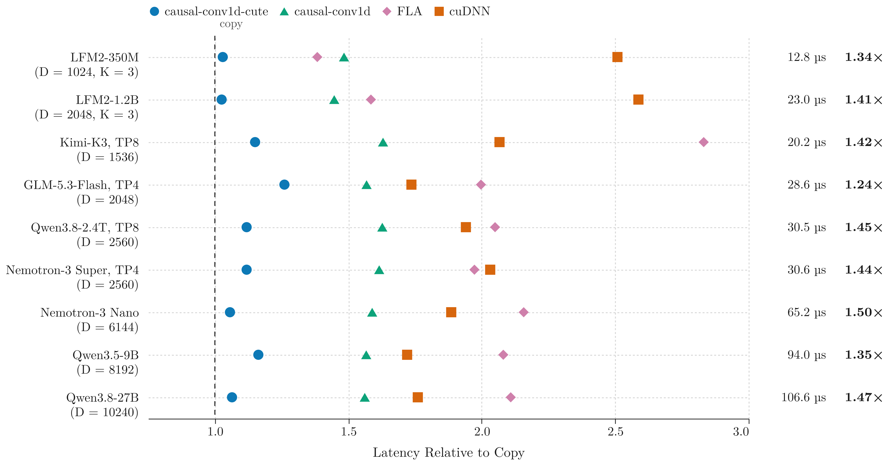  
**Figure 1 |** Prefill latency relative to a device-to-device copy of the same tensor, using channel-last `[B, L, D]` storage (B = 8, L = 2048, cold cache). Right: Our latency and speedup over the best alternative.

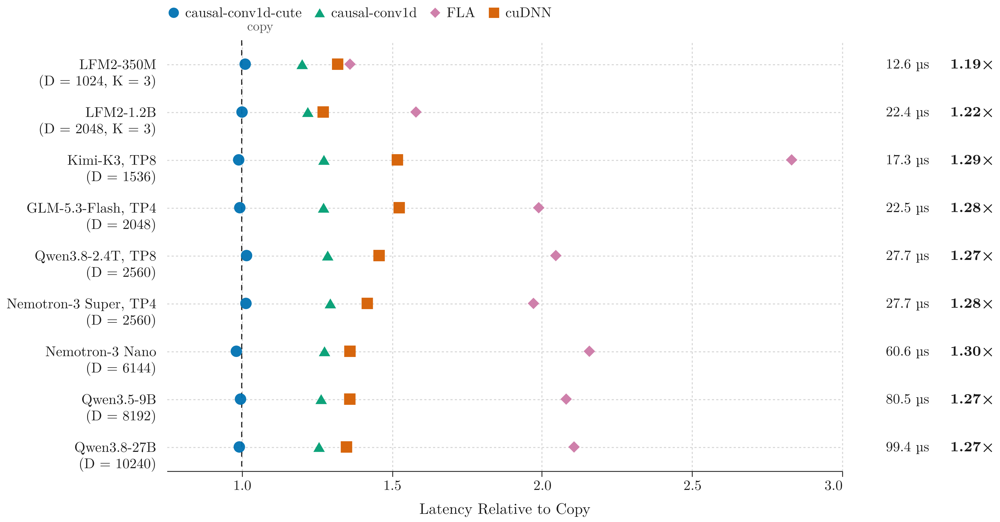  
**Figure 2 |** Same comparison as Figure 1, but for channel-first `[B, D, L]` storage.

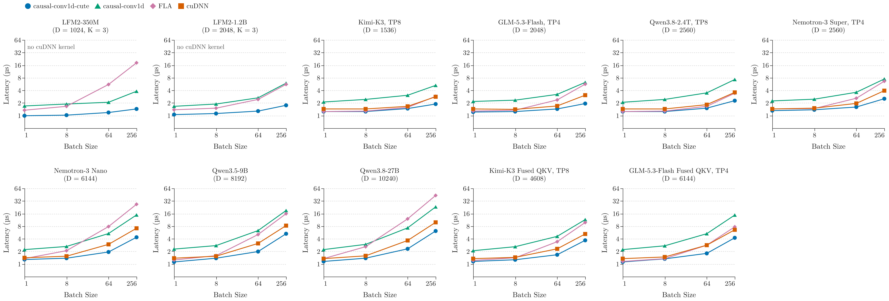  
**Figure 3 |** Single-token decode latency (warm cache). Conv state shape is `[B, D, K - 1]` where K = 4 unless otherwise noted.

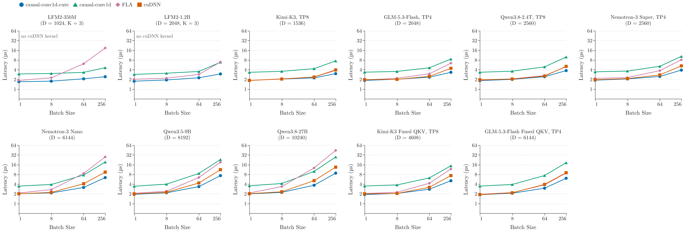  
**Figure 4 |** Single-token decode latency (cold cache).

### State Layouts for Decode

During large-batch decoding, performance is bound by memory bandwidth (the number of bytes moved). The standard ordered `[B, D, K - 1]` state layout forces the kernel to rewrite the entire state during every step. To combat this, we provide two optional alternative layouts. We compared these alternatives against all other implementations, including cuDNN's kernel which uses a padded state.

| State Layout | Work per step | Cold W / T / L | Warm W / T / L | Warm speedup, B ≥ 64 |
| --- | --- | --- | --- | --- |
| Padded `[B, D, 4]` | One load, one store per tile | 28 / 16 / 0 | 41 / 3 / 0 | 1.00 / 1.34 / 2.76 |
| Ring `[B, K - 1, D]` | Overwrites the oldest row only | 24 / 20 / 0 | 31 / 10 / 3 | 1.00 / 1.38 / 3.05 |

**Key Findings:**
*   At B = 256 (warm cache), the ring state layout is 1.30x to 1.38x faster than our own ordered-state kernel across four shapes containing 4608+ channels and no bias. For example, on Qwen3.8-27B, the ring state takes 4.67 µs compared to 6.14 µs for the ordered state (and 8.45 µs for cuDNN). On Nemotron-3 Nano, it provides a 1.15x speedup.
*   In scenarios not bottlenecked by memory bandwidth, the ring state performs anywhere from 15% slower to 12% faster. Therefore, the ordered state remains the default.
*   The ring layout has the only three warm-cache losses in this table, each of them one or two timer ticks against cuDNN's padded-state kernel at small batch: Nemotron-3 Super TP4 at B = 8 (1.31 µs against 1.25 µs), Nemotron-3 Nano at B = 8 (1.34 µs against 1.28 µs), and Nemotron-3 Super TP4 at B = 1 (1.28 µs against 1.25 µs). The drop-in ordered-state kernel has no warm-cache losses at all.

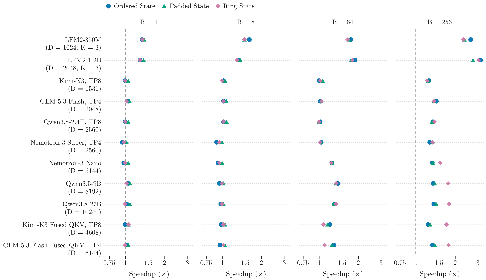  
**Figure 5 |** Decode speedup over the fastest competitor library (including cuDNN's padded-state kernel) across the three state layouts (warm cache).

### SGLang Specific Benchmarks

We recorded real tensor layouts from a live SGLang 0.5.20 server running Qwen3.8-27B and replayed them directly against SGLang's native Triton kernels (see [`benchmarks/bench_sglang.py`](benchmarks/bench_sglang.py)). Note that these times reflect the convolution kernel execution time, not the entire forward pass. The convolution states remain bit-identical across implementations.

| SGLang Path | Test Cases | Speedup |
| --- | --- | --- |
| Prefill (16 to 8192 tokens) | 12 | 1.03x to 2.17x |
| MTP verify (1 to 48 sequences) | 7 | 1.52x to 4.21x |
| Decode without MTP (1 to 256 seqs) | 9 | 1.31x to 1.82x |

Two facts about the kernels on the other side of this comparison are worth stating. SGLang's generic convolution supports kernel widths 2 to 4 only, and its loader passes `--use_fast_math` on Hopper alone, so a B300 server runs the precise-math build, which costs roughly 1.3x on models using SiLU; part of the margin in the table above is therefore that flag rather than our kernel. SGLang also ships a hand-written width-4 convolution for Inkling that arrived independently at nearly the same design as ours: packed channel-last tokens, strips of four tokens, and the convolution window held in registers. It loads 2 channels per load where our kernels load 16, and it computes SiLU with an exponential and a divide. We measure 1.28x to 1.83x faster with bit-identical output when no activation is applied, although Inkling ran as a single sequence in that comparison, so its variable-length bookkeeping is included in its time while ours ran dense.

**Unpacking Optimization:**
When multi-token prediction (MTP) is disabled, SGLang traditionally decodes using a single fused kernel per layer. This kernel reads the conv input from a combined `[Q | K | V | Z]` projection row, updates the conv state, and then scatters Z, B, and A into individual tensors. Our plugin seamlessly provides a replacement kernel that executes all of these operations in a single launch ([`unpack.py`](causal_conv1d_cute/unpack.py)). 

For example, on Qwen3.8-Flash-Next at TP = 4, both projections are kept in a single buffer, which places token rows 4120 elements apart. These rows process tiles of at most 8 channels. On this specific memory layout, our prefill is 1.20x to 2.24x faster, and decode is 1.19x to 1.78x faster.

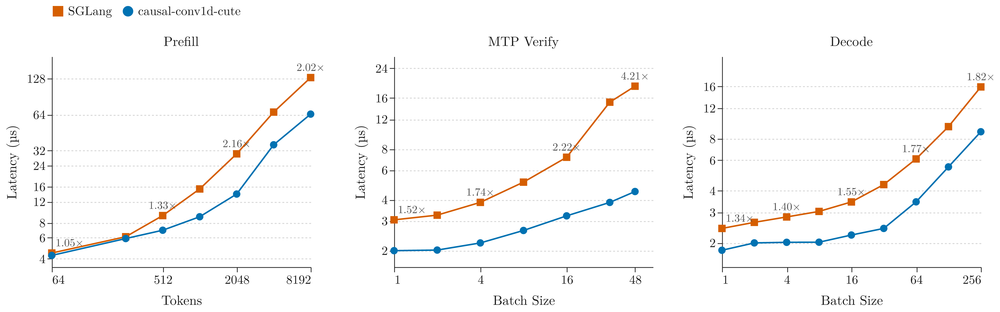  
**Figure 6 |** Conv kernel latency evaluated on Qwen3.8-27B tensor layouts extracted from SGLang (cold cache). Labels indicate our speedup.

### End-to-End Server Performance

To measure real-world impact, we ran two interleaved server sessions per configuration using standard SGLang cookbook recipes. The MTP accept length was pinned to 3 in all tests. ([Detailed write-up here](benchmarks/results/sglang_e2e_b300.md)).

| Model | Mode | Prompt Latency | Time per token (1 / 16 / 64 requests) |
| --- | --- | --- | --- |
| Qwen3.8-27B, 1 GPU | MTP | -1.0% (16K), -0.9% (2K) | -0.4% / -0.6% / n/a |
| Qwen3.8-27B, 1 GPU | no MTP | -0.9% (16K) | -0.1% / -0.4% / -0.9% |
| Qwen3.8-Flash-Next FP8, TP = 4 | MTP | -1.6% (16K) | -0.9% / -0.4% / -2.0% |
| Qwen3.8-Flash-Next FP8, TP = 4 | no MTP | +0.6% (16K) | -0.4% / -0.4% / -0.4% |

*(Note: The +0.6% latency increase observed is well within the 0.7% variance spread of the two baseline server sessions. Additionally, end-to-end task accuracy remains stable: GSM8K scored 95.0% with the plugin versus 95.2% without it.)*

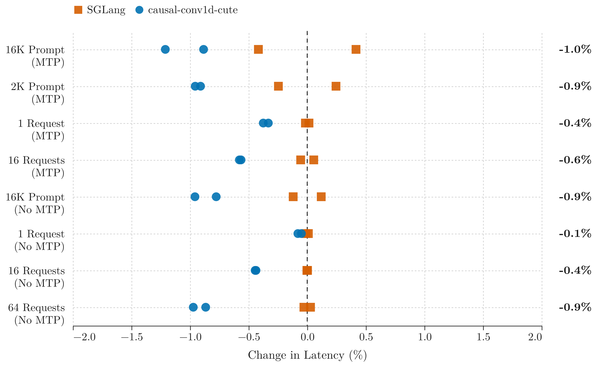  
**Figure 7 |** End-to-end latency changes in SGLang for Qwen3.8-27B. Each point represents one server session relative to the mean of two baseline sessions.

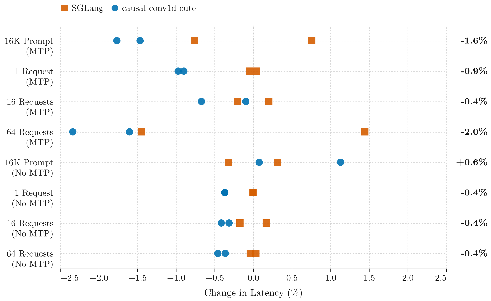  
**Figure 8 |** The same end-to-end latency changes for Qwen3.8-Flash-Next (FP8, TP = 4).

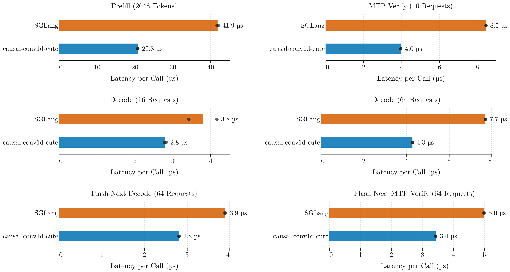  
**Figure 9 |** Convolution kernel latency per call inside the live server, extracted via the PyTorch profiler. (Bars: mean of two sessions; dots: individual sessions).

Inside the running Qwen3.8-27B server the convolution call drops from 42 µs to 21 µs during prefill, from 8.5 µs to 4.0 µs in MTP verification, and from 7.7 µs to 4.3 µs in decode without MTP at 64 concurrent requests. These are the absolute numbers behind the percentages in the table above: a kernel that runs twice as fast while accounting for 2% of the forward pass moves the forward pass by about 1%.

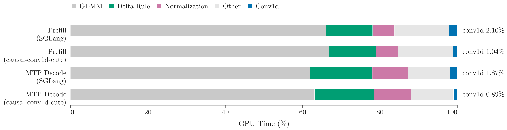  
**Figure 10 |** Breakdown of GPU kernel time share by kernel family for Qwen3.8-27B with MTP enabled.

---

## Architecture & Implementation Details

The operation implemented here is `out[b, c, t] = act(bias[c] + sum_k w[c, k] * x[b, c, t - width + 1 + k])`, which performs roughly `2 * width` floating-point operations for every element it reads and writes. Nothing in this package is compute bound. Every kernel described below is a decision about memory layout rather than about arithmetic, and the reference point that matters is a device-to-device copy of the same bytes rather than any peak rate of floating-point operations.

### Data Layouts and Numerics
*   **Weights:** Weights are packed once per layer into `(dim, P)` rows, where `P` is a power of two. This enables a single aligned memory load to fetch all the filters for a specific channel tile. A `(width, dim)` transpose is used for the channel-last kernels.
*   **Activations:** Activations are addressed in tiles of up to 16 adjacent elements. Each tile corresponds to a single 32-byte load or store, capitalizing on the widest memory transaction supported by the instruction set.
*   **Numerics:** Sums are accumulated in `float32`. The SiLU activation utilizes the hardware's approximate `tanh` via the formula `x * (0.5 * tanh(x / 2) + 0.5)`. When compared against a `float64` reference, 99.99% of `bfloat16` outputs are correctly rounded.

*   **Compilation:** Each kernel is traced once per shape signature with `cute.compile` on fake tensors whose sequence-length and stride extents are symbolic, carrying a declared divisibility and a declared alignment, so a single compiled kernel serves every length that honours those promises. Kernels are then invoked through tvm-ffi on the ambient CUDA stream. Compilations are cached on the signature, which is why the first call into a layer is slow and every subsequent call is not, and why weights are packed per layer rather than per call. Channel count, width, data type, bias and activation are compile-time constants inside the kernel; batch size and sequence length are not.

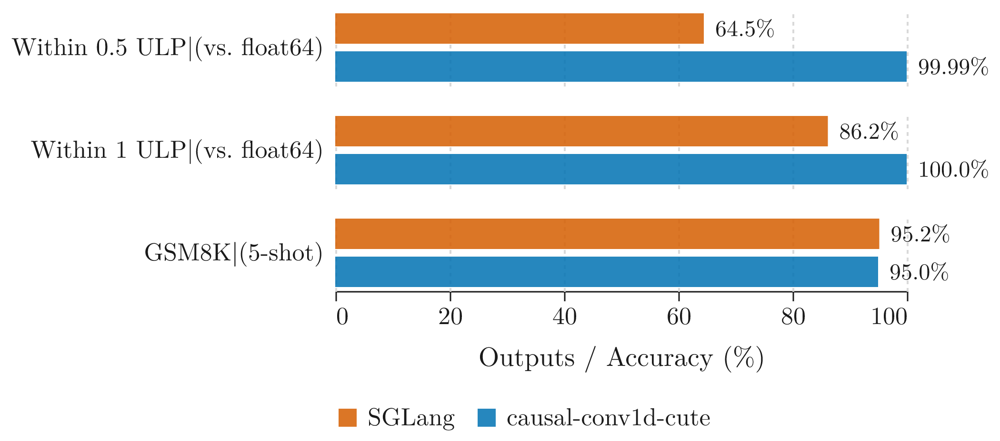  
**Figure 11 |** Share of `bfloat16` outputs falling within 0.5 and 1 ULP of a `float64` reference, along with GSM8K accuracy in a live server environment.

### Prefill Strategies
*   **Channel-First Prefill:** Threads are assigned one tile consisting of 16 consecutive tokens from a single channel, plus the tile immediately preceding it. Ragged sequence lengths are handled by running full tiles without bounds checks, followed by a second pass to specifically handle the final tile of each row.
*   **Channel-Last Prefill:** Threads process 16 adjacent channels and walk down a short strip of tokens, ensuring all loads are issued before the first store. Consecutive strips share `width - 1` tokens. 
    *   *The Row Stride Issue:* When the token rows are spaced apart by a power of two bytes (common in serving engines parsing fused projections), shared rows often collide in the cache and get evicted too early. For a width of 4, this cache collision can make the convolution 1.18x to 1.39x slower. To fix this, a thread walking a width of 4 will process several strips at once, keeping shared tokens safely in registers to recover a 1.16x to 1.27x speedup. For a width of 3, a single strip remains optimal (see [`benchmarks/row_stride.py`](benchmarks/row_stride.py)).

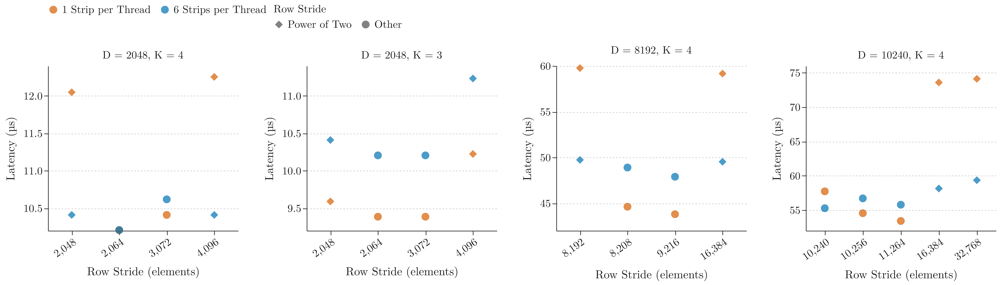  
**Figure 12 |** Channel-last prefill performance (8192 tokens) plotted against the distance between token rows in the input buffer (cold cache).

*   **Variable-Length Prefill:** For a single sequence, this requires just one kernel launch. Because the first `width - 1` outputs rely on the old conv state, the thread managing them discards its calculated values, saves them to the last row of its span, and overwrites them with the new state. A small secondary launch manages sequence boundaries for multiple sequences. Sequence ends are read directly on the device, making padded input buffers completely safe to use.

### Integration within Serving Engines
Integrating a kernel plugin into a live server involves subtle systemic side effects. During our dry-run tests (where the plugin was loaded but SGLang's native kernels still did the work), we found the server ran 0.3% slower. This slowdown occurred because our plugin allocated 12 MB of packed conv weights during SGLang's CUDA graph capture, forcing the allocator to shift every subsequent buffer. Furthermore, allocating an output buffer just one row larger than the stock operator shifted memory into an entirely different allocator size class, causing an additional 0.34% slowdown. Kernel compilation itself had no impact. 

To resolve these issues, our serving kernels now read bias-free weights in-place directly from the model's native `(dim, width)` tensor. Packed weight copies are built lazily (or immediately upon model load, if a bias is present), and output buffers are allocated to precisely match the shape of the stock operator.

### Decode Kernel Design

Each decode kernel assigns a thread one tile of channels: it loads the conv state, the filter weights and the incoming token, accumulates in `float32`, and stores the new state together with the output. All three state layouts share that shape and differ only in how many bytes a single step has to move. The tile widths, block sizes and load and store ordering were not chosen by intuition; they come from a cost model of this GPU that we measured across 13,360 compiled configurations of one parametric kernel. That model, the data behind it, the design space it came from and the compiler behaviour it had to work around are all documented in the optimization log at the end of this README.

---

## Reproducing the Results

To run the tests and reproduce the benchmark figures locally:

```bash
# Install development and benchmark dependencies
pip install -e ".[dev]"   && pytest tests
pip install -e ".[bench]" && cd benchmarks

# Run baselines and benchmarks
python build_dao.py                                  # Builds upstream baseline (uses identical nvcc flags)
python bench_all.py --out results.csv --warm         # Runs 5 cold + warm rounds across all implementations
python summarize.py results.csv

# Generate SGLang benchmarks and figures
python copy_baseline.py copy.csv 
python bench_sglang.py --out sglang.csv 
python make_figures.py

# Rebuild tuned.json for your specific GPU architecture
python tune.py fwd update                            
```

The decode design space is explored separately, one shard per GPU, and reported with main effects and the strongest pairwise interactions:

```bash
mkdir -p explore/ptx_0 && cd explore/ptx_0
CUTE_DSL_KEEP=ptx CUTE_DSL_DISABLE_FILE_CACHING=1 PYTHONPATH=../.. \
    python ../../explore_decode.py --out .. --shard 0 --nshards 4
cd ../.. && python explore_report.py explore
python explore_export.py explore results/explore_decode.csv
```

---

## Acknowledgements

*   Packaging, linting configuration, and repository structure are based on [quack](https://github.com/Dao-AILab/quack).
*   The reference operator semantics are sourced from [causal-conv1d](https://github.com/Dao-AILab/causal-conv1d). 
*   The single-load padded decode state and the `tanh` approximation for SiLU are inspired by the cuDNN frontend's causal conv1d kernels. 

**License:** Apache-2.0.

---

## Optimization Log

This section records how the kernels described above were actually arrived at, roughly in the order the work happened, including the measurements that turned out to be misleading and the ideas that did not survive contact with the hardware. Unless stated otherwise, every number below was produced on the same B300 with the timing protocol described in the benchmarks section. Where a figure comes from a single timing round or from an instrumented run rather than the full protocol, it is labelled as such, because those were the numbers that misled us most often.

### How These Numbers Were Taken

Every kernel time reported in this repository is CUPTI activity measured on the device for a single call captured in a CUDA graph and then replayed: 10 replays to warm up, 40 replays timed, the median of each round, and the median of five rounds reported alongside the fastest and slowest round. Host-side launch cost falls outside that window, which matters a great deal when the kernel itself runs for 2 µs and the launch path costs roughly the same. Timing a loop of back-to-back launches with a wall clock measures launch-to-launch throughput instead of per-call latency, which is a different physical quantity, so it was never used here.

Both cache states are reported because neither one is the truth on its own. The cold-cache column zeroes a buffer twice the size of the L2 cache and synchronizes the device before every replay, always outside the timed window. Inside a real server neither extreme holds: the input tensor was just written by the projection that precedes the convolution and is therefore warm, while the filter weights and the conv state genuinely are cold. Cold-cache absolute times are consequently pessimistic for every implementation in the tables, and the small-batch decode ties are the rows most likely to move under different conditions. One further caution is worth recording: two container images carrying different flashinfer versions timed the same small kernel as much as 1.8x apart, so every comparison here was produced inside a single image, and numbers measured in different images are never placed in the same table.

### What a Copy Costs, and What a Launch Costs

The first two measurements in this project were not kernels at all. A device-to-device copy of the same number of bytes peaks at roughly 6 TB/s on this GPU, and because a depthwise convolution performs only about `2 * width` floating-point operations for each element it moves, that copy is the entire budget. An early version of the channel-first kernel appeared to beat the copy, which told us the baseline was weak rather than that the kernel was extraordinary, so the baseline was rebuilt properly with tuned copy kernels measured next to `torch.clone` over 10 rounds with the spread reported ([`benchmarks/copy_baseline.py`](benchmarks/copy_baseline.py)). Measured against that rebuilt baseline, the shipped channel-first prefill runs at 0.95x to 1.04x the time of a pure copy. From that point the interesting question stopped being how much faster we were than another library and became how much of the copy was left to claim.

Decode has a second budget, and it is not bandwidth at all. At batch 1, an empty kernel launch costs 1.06 µs, adding a single cold load takes it to 1.66 µs, and loading everything a decode step genuinely needs takes it to 1.98 µs. Flash-linear-attention was already running at 2.0 µs. No implementation can gain more than roughly 15% at batch 1, no matter how it is written. Every small-batch tie in the tables above is that measurement rather than a tuning failure, and knowing it early prevented a considerable amount of work that could never have paid for itself.

One more quantity is worth measuring once. This GPU has 148 streaming multiprocessors, each holding 8 co-resident warps, so 1,184 warps execute concurrently at saturation. The large prefill launches do reach that figure, which is why their throughput is set by how long a warp lives rather than by instruction count. The batch-1 decode kernel, by contrast, occupies 8 multiprocessors and 64 warps, so its result does not depend on having the whole chip to itself.

### The Hour We Lost to a Build Flag

The first comparison against the upstream CUDA implementation showed our predecessor kernel losing by as much as 1.75x. The cause was not the kernel. Upstream's `setup.py` passes `--use_fast_math` and our build did not. On shapes with a SiLU activation that flag alone is worth a median of 1.30x and as much as 1.44x, while shapes without an activation are entirely unaffected. An hour of careful measurement had been describing a compiler flag.

Two lasting practices came out of that hour. Both sides of every comparison are now built here from recorded commits with recorded flags, and [`benchmarks/BASELINES.md`](benchmarks/BASELINES.md) states exactly how each implementation is called so that any number can be challenged. The same question was then asked of every other implementation in the comparison, which is how the note in the SGLang section came about: SGLang's kernel loader passes that flag only on Hopper, so the convolution a B300 server actually executes is the precise-math build.

### The First Decode Kernel: a Padded Conv State

cuDNN's native kernel is width 4 and reads a 4-element conv state in a single load, an idea that generalizes cleanly: pad the state to the next power of two and an entire channel's state becomes one aligned load and one aligned store regardless of the kernel width. At width 7 that is 4 loads and 2 stores where the ordered state requires 15 and 7. This kernel holds the best record of any decode kernel here, winning 41 and tying 3 of 44 warm-cache cases against every other implementation, and it is still not the default, because it asks the calling engine to store something other than what it already stores.

### The Conv State the Engine Already Has

A drop-in replacement cannot require a serving engine to change its cache layout, so the ordered `[B, D, K - 1]` state needed a kernel of its own. Each thread takes a tile of channels, loads the state, the filter weights and the incoming token, accumulates in `float32`, and then stores the shifted state and the output. This is the kernel selected by all 44 ordered-state entries in `tuned.json`. Two earlier decode kernels remain in the package and are still reachable through `update_candidates`, a scalar variant and a two-dimensional variant, and the tuner has never once chosen either of them on this GPU.

### 13,360 Configurations, and What They Were Actually Good For

The decode kernel was then rewritten once with every structural choice exposed as a parameter: channels per thread, tiles per thread, block size, grid shape, weight layout, accumulation order, conv state layout, the order of the loads, the order of the stores, and the `min_blocks_per_mp` launch hint. The full cross product was compiled, checked against a `float32` reference and timed at four batch sizes with both a warm and a cold cache, producing 13,360 configurations sharded across four GPUs with no compile errors and no correctness failures ([raw data](benchmarks/results/explore_decode_qwen3.8-27b_b300.csv)).

The search improved the shipped kernel by 0% to 8%. Only two small wins survived re-timing, a block size at batch 8 and time-major weights at large batch, and the genuine gain of that day had come earlier from a hand-written change to how few channels a thread handles at small batch. It is also worth stating plainly that the sweep's own best numbers are single-round minima selected from thousands of candidates and are therefore biased low, by as much as 8% at batch 1, which is why anything retained from the search was re-timed under the full five-round protocol before it was believed.

What the sweep was genuinely good for is the main effects, which are worth considerably more than its winner. Taking the best configuration containing each value and expressing it relative to the best configuration overall (single-round sweep timings, Qwen3.8-27B decode, warm cache):

| Structural choice | Values explored | Cost at B = 1 | Cost at B = 256 |
| --- | --- | --- | --- |
| Bounds check in the launch | needed, not needed | 1.83x | 1.26x |
| Tiles per thread | 1, 2, 4 | 1.06x, 1.09x | 1.33x, 2.03x |
| Channels per thread | 1 to 16 | 1.32x at 16 | 1.48x at 1 |
| Block size | 32 to 512 | 1.06x | 1.08x |
| Conv state layout | ordered, padded | 1.03x | 1.02x |
| Store order | state first, output first | 1.09x | 1.02x |
| Weight layout, grid shape, accumulation order, load order | | ≤ 1.01x | ≤ 1.03x |
| Launch hint `min_blocks_per_mp` | unset, 4 | 1.00x | 1.02x |

Reading down that table, what actually matters is whether the launch requires a bounds check at all, how many channels a single thread handles, and keeping one tile per thread. Weight layout, grid shape, load order and accumulation order are effectively noise, and the launch hint is worth nothing at the optimum, although averaged across the whole space leaving it unset is 7% to 12% better; the package never passes it. Issuing every load before the first store does not appear in the table because that choice only exists when a thread handles more than one tile, and in that situation it is worth 1.10x with two tiles and 1.21x with four at batch 1.

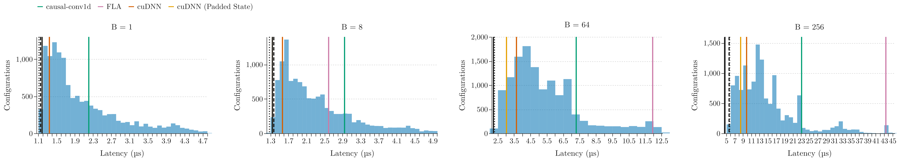  
**Figure 13 |** Warm decode latency across 13,360 configurations of a parametric kernel (Qwen3.8-27B shape). Black markers denote the best configurations for the ordered state (dashed), padded state (dotted), and the ring-state kernel (solid). The slowest 10% are excluded. Essentially the entire spread is produced by the first four rows of the table above.

At that point the brute-force search had run its course, and the valuable part of its output turned out to be the PTX instruction histogram recorded beside every configuration rather than the ranking. Two configurations with the same instruction counts differed by more than 2x: two adjacent 8-byte tiles handled by one thread took 12.4 µs, while the same tile taken across two batch rows took 5.8 µs. That difference is invisible in any instruction count and visible only in the addresses, and it became the cost model that every subsequent kernel was designed against:

1. A kernel launch costs approximately 1.1 µs warm and 1.75 µs cold, plus a fraction of a nanosecond per thread block. With tens of thousands of blocks, the block count alone sets the latency.
2. At large batch sizes the time is simply bytes moved divided by bandwidth, so only moving fewer bytes helps. This is exactly what the ring state does, moving 6 elements per channel and step instead of 8.
3. Memory transactions issued by one thread to the same cache line execute one after another, while transactions to different lines overlap.
4. A load issued after a store waits for that store, so every kernel here issues all of its loads first.
5. A load whose address is produced by another load costs a second memory round trip. The first ring kernel looked up rotated weights by sequence position and lost 15% at batch 8 and below; it now loads position-independent weights alongside everything else and selects the per-row weights in registers.
6. Arithmetic is nearly free next to memory transactions, except that at batch 8 and below the latency of the kernel is the latency of a single thread, so threads handle 2 to 4 channels there and 4 to 8 at large batch.
7. The bias needs a load of its own. Packed into the weight row it doubled that row to two transactions on a single cache line and cost 19% at batch 256.

From this point onward the working method changed: state a hypothesis, predict the resulting number, read the generated program, and only then run the kernel.

### The Ring Conv State

Rule 2 explains why the ordered state loses at large batch, since every step rewrites all of it. A ring state overwrites only the oldest row, which moves 6 elements per channel and step instead of 8. The gain was predicted from the rule and confirmed in the exploration harness before the layout was written into the package: batch 256 with a warm cache went from 6.21 µs to 4.32 µs, and to 4.00 µs when a thread handled two batch rows, a variant that requires an even batch size and is not in the shipped kernel. Inside the package proper, on Qwen3.8-27B at batch 256 warm, the ring kernel runs at 4.67 µs against 6.14 µs for the ordered state.

The first version of that kernel lost 15% at batch 8 and below, and rule 5 explains why: it looked up the rotated weights by sequence position, so the address of the weight load depended on the result of another load. Loading position-independent weights alongside everything else and selecting the correct row in registers took batch 1 from 1.31 µs warm and 2.30 µs cold to 1.15 µs and 1.98 µs.

Two further predictions came out of rule 3, and they are worth reporting in the order they happened rather than as conclusions. The bias had been packed into the weight row, which produced two transactions on a single cache line; giving it a load of its own was predicted in advance to land between 3.6 µs and 3.8 µs, and measured 3.78 µs, down from 4.51 µs, on Nemotron-3 Nano at batch 256 warm. The second prediction was refuted without running anything at all. Three 4-element state loads on one cache line ought to serialize, so a single 12-element transaction should have won at small batch, except that the widest memory transaction the instruction set offers is 32 bytes, which means a 12-element tile compiles to three 8-byte loads however it is sliced. Reading the generated PTX answered that question in ten minutes and consumed no GPU time.

### Prefill, Read From the Generated Code

The prefill kernels were given an audit of their own generated code before they were given a benchmark. The channel-first kernel contained a genuine `div.s32` plus six instructions correcting its rounding ahead of every single load, and it recomputed the thread index from scratch for the store. Replacing the division with a multiply-high leaves no divides at all and places the first load at instruction 14 rather than around instruction 34, which is worth 3% to 5% on small shapes and essentially nothing on the large ones, where the kernel was already running at the speed of a copy.

The channel-last kernel walks a strip of tokens per thread, and interleaving its stores with its loads cost 1.6x: issuing every load before the first store took width 7 from 42 µs to 26 µs, which is rule 4 discovered before rule 4 was written down. Sequence lengths that are not a multiple of the tile size are handled by a pass with no bounds checks across the interior followed by a small second launch over the boundary tiles of each row, and that change took a 2047-token case from 41 µs to 21.3 µs where cuDNN took 35.3 µs.

Strip length is the one prefill parameter we still cannot explain. At width 7, five tokens per strip takes 23.6 µs, six takes 28.4 µs and seven takes 25.9 µs, and there are no register spills at any of those settings. Rather than continue guessing, the tuner now measures every strip length from 2 to 12, which is also what finally took the width-3 channel-last kernel to the speed of a copy. The degenerate strip of a single token still wins in 6 of the 54 channel-last entries in the tuned table, all of them at 1024 or 2048 channels and batch 1.

Intra-kernel profiling agrees with all of the above and adds one useful detail. Instrumenting the phases of the width-7 strip kernel shows a warp spending 65% of its lifetime waiting on loads, 26% computing and 2% storing. In decode the loads issue within 98 ns, compute is close to zero, and the stores absorb 564 ns waiting for the loaded values to arrive, which restates "a launch plus one cold memory round trip" from the opposite direction. Those runs execute eagerly with instrumentation active, so the 30.5 µs span they report for a kernel that CUPTI measures at 26.1 µs is not a time worth quoting, but the split between the phases is trustworthy.

### What Changes Inside a Live Server

The kernel comparisons above replay recorded tensor layouts. A live server is a different measurement, and it begins with finding out what the engine's own kernel actually does. Without speculative decoding, SGLang does not call a convolution kernel at all: it calls one fused kernel per layer that reads the convolution input in place from the leading 10,240 columns of a `[Q | K | V | Z]` projection row, updates the conv state, and copies Z, B and A into tensors of their own. Replacing only the convolution would have left three copies behind, so our kernel performs the copies as well, in a single launch, with every store ordered after every load. At batch 1 the fused kernel takes the same 1.79 µs as the convolution alone, so the copies are free there; at 64 concurrent requests the call drops from 7.72 µs to 3.79 µs.

The end-to-end serving numbers then refused to move, and the kernel was not the reason. With the plugin installed but SGLang's own kernels still running, which is the dry-run control described earlier, decode remained 0.3% slower than stock. The plugin's allocations were shifting the server's memory layout: 12 MB of packed weight copies made while CUDA graphs were being captured, and a prefill output buffer one row larger than the stock operator's, which lands in a different allocator size class and costs 0.34% on its own. Compiling and loading kernels had no measurable effect whatsoever.

Fixing that meant shipping a slower kernel deliberately. The serving path now reads the model's own weight tensor in place, which costs roughly 0.5 µs per call at 64 concurrent requests: the convolution call in the server settles at 4.3 µs where a packed copy would have made it 3.8 µs. The packed copy was the source of a penalty ten times larger than the half microsecond it saved, so the kernel gives up that half microsecond and the server gets considerably more back. This is the kind of trade that only appears when the dry-run control exists, which is why it is worth running one before attributing a change of a few tenths of a percent to any kernel.

### Ideas That Did Not Work

The 13,360-configuration search is the largest entry on this list. It produced two small wins, a main-effects table worth keeping and a cost model that emerged from two of its PTX dumps rather than from its ranking, and none of that required the last ten thousand configurations.

SiLU was first implemented with an exponential and a divide, which is the entire reason shapes with an activation initially lost by 1.04x to 1.29x. The `tanh` formulation borrowed from cuDNN's source fixed that, and then had to be qualified: the hardware's approximate `tanh` is 3.8e-6 off in `float32`, so `float32` outputs use the exact instruction instead.

Handling more than one tile per thread never won at any batch size, and the `min_blocks_per_mp` launch hint never won at the optimum. A decode kernel operating on a `[B, K - 1, D]` state that still shifted the state on every step was written, never selected by anything, and has now been deleted; the ring kernel is what that storage order is genuinely good for. Time-major filter weights, which are a different thing entirely, did ship. Two older decode kernels remain in the package because they cost nothing to keep, with the caveat noted above that the tuner never selects them.

A 20480-channel shape was added to the benchmark, tuned, measured and drawn into a figure, then removed together with that figure once it became clear that nobody serves that model on a single GPU. Tuning and plotting a shape that cannot be deployed is a way of publishing a number that is simultaneously true and useless.

Two correctness bugs deserve recording, because both of them passed a test suite first. The strip kernel read out of bounds whenever a strip was shorter than `width - 1`, and one shape passed anyway purely because of how it happened to be laid out in memory. Separately, out-of-range threads were being mapped onto the last channel group, which is harmless when the output cannot alias the input and is a race when the conv state is updated in place, since a duplicate thread can read a state that its twin has already shifted. That one passed two consecutive runs and failed on the third. Decode kernels now launch exactly as many threads as there is work, or carry a real bounds check, and both cases have regression tests.

### Compiler Behaviour We Had to Design Around

The fused `bfloat16` multiply-add is only formed in the final block of a kernel. A rarely taken branch placed after the hot path therefore turns every multiply-add inside that path into a conversion followed by a `float32` multiply-add, which is 1.7x slower and leaves every test passing, so all conditional work is evaluated first.

In the channel-last variable-length kernel the filter weights are passed twice, once as `wtm` and once as `wtail`, because the thread that handles the conv state has to load them through an argument of its own. Loading them through the same argument allows the compiler to merge both loads, keep the converted weights alive into the conditional state block, and silently lose the fused multiply-add in every strip.

### Open Questions

Strip length is not monotonic in the way described above, and we have no mechanism for it, only a tuner that measures it.

GLM-5.3-Flash at TP = 4 is the one prefill shape that is nowhere near the speed of a copy, at 1.26x, while the two 2560-channel shapes with the same width and activation sit at 1.12x and the 10240-channel shape sits at 1.06x. This remains unexplained.

Everything here is tuned for a single GPU architecture, and the design space was explored on exactly one shape, 10240 channels at width 4. Whether the seven rules hold at 1024 channels, or on a GPU with a different ratio of launch cost to memory bandwidth, is untested.

The ring conv state is the largest decode win in the package and is not what the SGLang plugin uses, because it requires the engine to allocate and carry its cache in that layout. Handling two batch rows per thread is worth a further 7% on top of it and is likewise absent from the shipped kernel.

There is no backward pass, several sequences in a single variable-length prefill still require two launches, and at batch 1 the fused serving kernel costs exactly what the convolution alone costs, which means those threads are waiting on memory with room for more work that nothing has yet been given to them.
